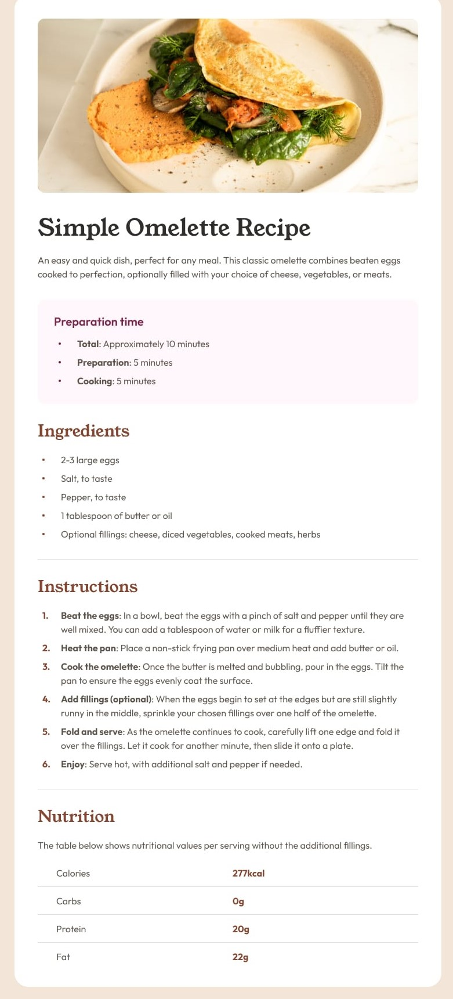
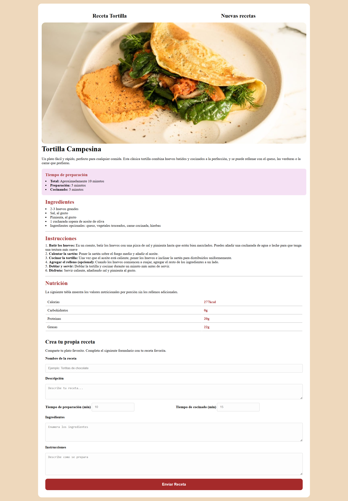

# Receta de Omelette: Ejercicio de HTML y CSS

¡Bienvenido/a al ejercicio de maquetación de una receta de omelette! Este proyecto está diseñado para que tengas un primer contacto con HTML y CSS, aprendiendo a estructurar contenido y a darle estilo.

El ejercicio se divide en dos partes para que puedas progresar paso a paso.

---

## Parte 1: Estructura y Estilos Básicos

En esta primera parte, nos centraremos en la maquetación de la receta de omelette, utilizando HTML para estructurar el contenido y CSS para aplicar estilos básicos.

### 🎯 Objetivo de la Parte 1

El objetivo es crear una página web estática con la receta, aplicando estilos para que sea legible y visualmente agradable.

### 📂 Archivos para la Parte 1

-   `index.html`: El archivo principal donde escribirás el código HTML de la receta.
-   `css/estilos.css`: La hoja de estilos donde añadirás las reglas de CSS.
-   `img/image-omelette.jpeg`: La imagen del omelette para la receta.

### 🚀 Instrucciones de la Parte 1

1.  **Estructura HTML**: Abre `index.html` y añade la estructura semántica de la receta con etiquetas como `<header>`, `<main>`, `<section>`, `<h1>`, `<h2>`, `
`, `<ul>`, `<li>`, etc.
2.  **Estilos CSS**: Enlaza `css/estilos.css` en tu `index.html` y aplica estilos para colores, fuentes y espaciado.

### 🎨 Resultado Esperado (Parte 1)

Al finalizar esta parte, tu página debería verse así:

---

## Parte 2: Navegación, Formulario y Diseño Responsivo

En la segunda parte, añadiremos funcionalidades más avanzadas a nuestra página, como un menú de navegación, un formulario interactivo y diseño responsivo.

### 🎯 Objetivo de la Parte 2

El objetivo es mejorar la página con navegación interna, un formulario para añadir nuevas recetas y asegurar que se vea bien en dispositivos móviles.

### 📂 Archivos para la Parte 2

-   Continuarás trabajando en los mismos archivos: `index.html` y `css/estilos.css`.

### 🚀 Instrucciones de la Parte 2

1.  **Navegación**: Añade un menú de navegación en el `<header>` con enlaces a las secciones de la página.
2.  **Formulario**: Crea una nueva sección con un formulario para que los usuarios puedan enviar sus propias recetas.
3.  **Diseño Responsivo**: Utiliza media queries en tu CSS para que la página se adapte a pantallas más pequeñas.

### 🎨 Resultado Esperado (Parte 2)

Al finalizar la segunda parte, tu página completa debería verse así:

¡Mucha suerte y a programar!